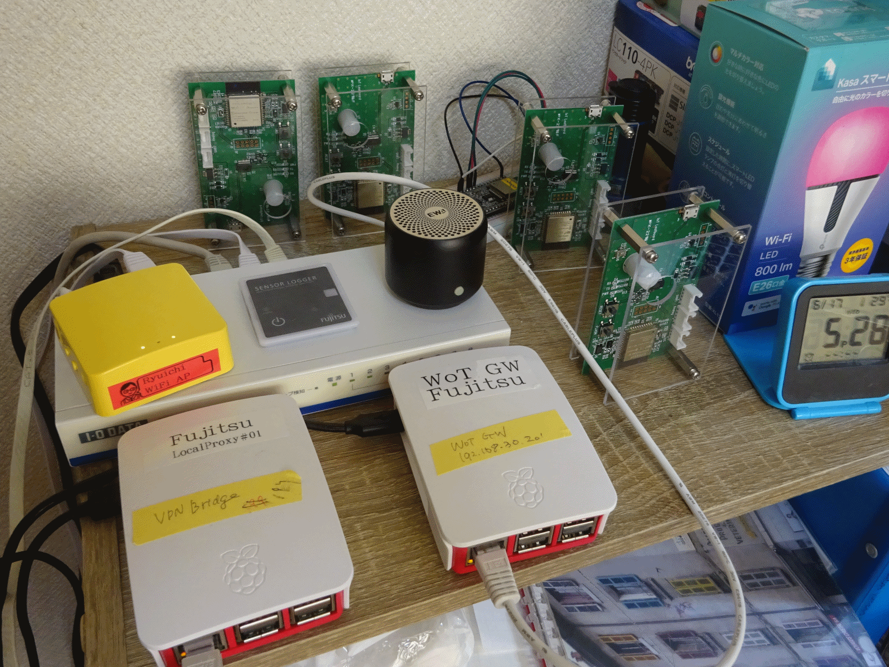
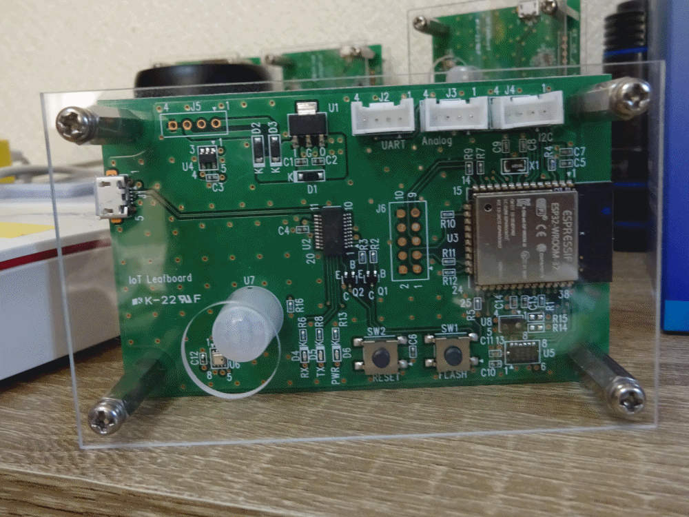

# Fujitsu - June 2020 Online Plugfest

Fujitsu provides two services:

- Sensor units (temperature, humidity, air pressure, human detection, etc.)
- A local proxy



## Sensor units

Several sensors equipped on a ESP32 wifi module that has a WoT interface software. 

You can get the TD of this device with HTTP access as follows:
```
Example:
curl http://IP addr of sensor unit/Things/TD
```



## Local proxy

The proxy is allinged to the intermediary specified in the WoT achitecture document. It can aggregate multiple WoT devices and manage the device information inside.

First, a new WoT device is requied to register to the proxy. After this, comsumers can get TDs of WoT devices to be registered before.

```
Example:
To register
curl -X POST -H 'content-type: application/json' -d '<TD>' http://192.168.30.10/Things/register

To get device list of WoT devices ID
curl http://192.168.30.10/Things

To get a TD
curl http://192.168.30.10/Things/'ID'
```
