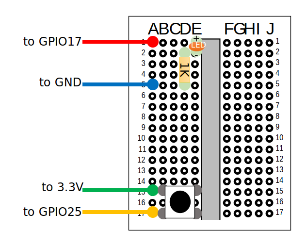
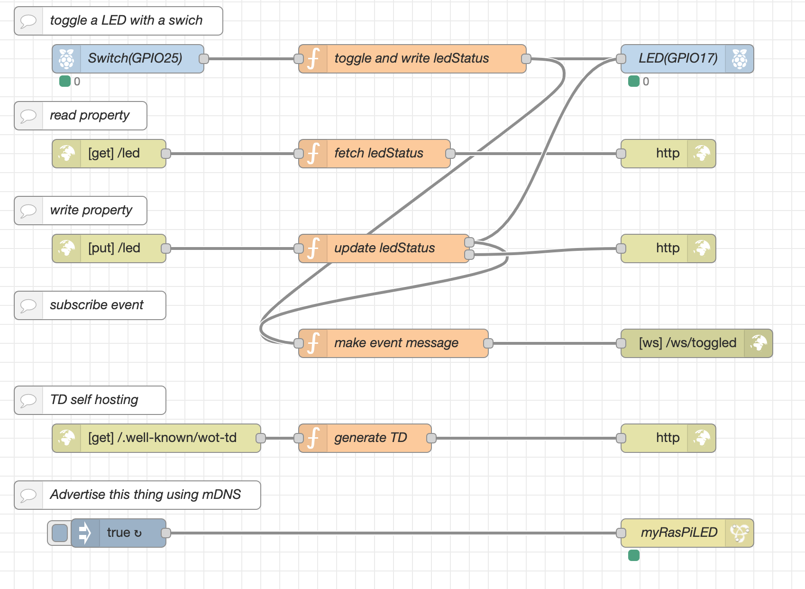

# Hitachi - June 2020 Online Plugfest

We provide a simple LED lamp.


## Web of Things from scratch

Parts list:
- 1 RaspberryPi model B
- 1 breadboard
- 1 switch
- 1 LED
- 1 1k ohm resistor
- 4 wires

1. create a circuit as follows:


2. [install Node-RED](https://nodered.org/docs/getting-started/raspberrypi).

3. [install node-red-node-discovery](https://flows.nodered.org/node/node-red-node-discovery) 

4. write a flow.

- [source file](flows.json)

5. deploy.


## TD Discovery

1. browse `_wot._tcp` service on plug-fest VPN.  for example:
```
% avahi-browse -r _wot._tcp
+  if0 IPv6 myRasPiLED                                    _wot._tcp            local
+  if0 IPv4 myRasPiLED                                    _wot._tcp            local
=  if0 IPv6 myRasPiLED                                    _wot._tcp            local
   hostname = [ktorpi.local]
   address = [xxxx:xxxx:xxxx:xxxx:xxxx:xxxx:xxxx:xxxx]
   port = [1880]
   txt = ["retrieve=/.well-known/wot-td"]
=  if0 IPv4 myRasPiLED                                    _wot._tcp            local
   hostname = [ktorpi.local]
   address = [xxx.xxx.xxx.xxx]
   port = [1880]
   txt = ["retrieve=/.well-known/wot-td"] 
```

2. retrieve TD using above information
```
% curl -u user:pass http://ktorpi.local:1880/.well-known/wot-td > hitachi-led.jsonld
```

### If you can't get a TD ...

please use [this](./hitachi-led.jsonld).

## Authentication

Basic security scheme is supported.

The credential will be posted on member's mailing list.

## API

* `GET /led`: read status of LED.
  - OFF: `{"value": 0}`
  - ON:  `{"value": 1}`
* `PUT /led`: write status of LED.
  - input value is same as above .
* websocket `/ws/toggled`: emit a LED status when switch is toggled
  - emitting value is same as above.
* mDNS advertisement `myRasPiLED._wot._tcp`
  - Because the discovery-node doesn't support subtypes, we didn't use subtypes.
