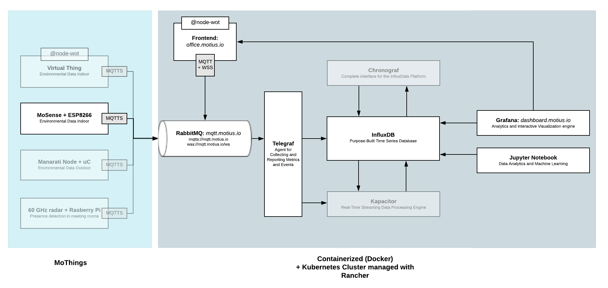

# MotiusIO - June 2020 Online Plugfest
We've extended our Sensor boards (MoSense) with WoT capabilities. 

### MoSense Sensorboard


### MotiusIO Ecosystem


#### RabbitMQ
All the communication with the Things and services around that go through our RabbitMQ message broker, either via MQTT or MQTT over WebSocket. 

### Authentication
The RabbitMQ message broker needs basic credentials, that will be communicated with W3C WoT members. 

>W3C WoT membership is required to access these credentials.
>Please do not repost them in a public forum
>(for example,
>do not check the keys into a public github repo as part of a test suite,
>post on a forum,
>share in a public messaging system, etc).

### TD Discovery
We implemented a very simple discovery flow. We've built this around the idea, that only the Thing itself can know it's current TD, and should therefore communicate it. The flow is implemented on 2 dedicated MQTT Topics. 

#### The Flow for a Thing:
1. Initially publish TD on `things/tds` (inform all subscribed consumers)
2. Subscribe to `things/discover` (listen if a consumer wants to discover Things)
2. When message received on `things/discover` publish TD on `things/tds`

#### The Flow for a new Consumer, that wants to discover Things:
1. Subscribe to `things/tds` (TDs will be published here)
3. Publish message to `things/discover` (inform all subscribed Things)

Example Consumer (Node.JS) can be found [here](./Discovery.Examples).

#### If you can't discover a TD...
please use [this](./MoSenseTD.jsonld).

### Historic (timeseries) data
Historic (Sensor)data is something that we need in a lot of our projects. To explore, how this can play together with WoT, we've added an experimental implementation for historic data in TDs, as a new form for every property, e.g.

```json
   "properties": {
    "temperature": {
      ...
      "uriVariables": {
        "from": {
          "type": "string",
          "@type": "ISO8601DateTime",
          "description": "Start of Timerange in format 2020-06-09T00:00:00Z"
        },
        "to": {
          "type": "string",
          "@type": "ISO8601DateTime",
          "description": "End of Timerange in format 2020-06-10T00:00:00Z"
        }
      },
      ...
      "forms": [
        ...
        {
          "@type": "getHistoricData",
          "href": "http://historic.motius.io/things/STUTTGART:BC:DD:C2:2D:C8:31/properties/temperature{?from,to}",
          "contentType": "application/json",
          "op": "readproperty",
          "htv:methodName": "GET",
          "security": ["no_sc"]
        }
      ]
    }
```

This points to a simple API, that fetches the historic data from an InfluxDB and returns it as an JSON array. 
You can e.g. check it out with a GET request to 
`GET http://historic.motius.io/things/STUTTGART:BC:DD:C2:2D:C8:31/properties/temperature?from=2020-06-14T00:00:00Z&to=2020-06-16T00:00:00Z`
or 
`GET http://historic.motius.io/things/STUTTGART:BC:DD:C2:2D:C8:31/properties/temperature`

ATTENTION: the API is experimental, not very well tested (yet) and might be not 100% stable (yet). 
