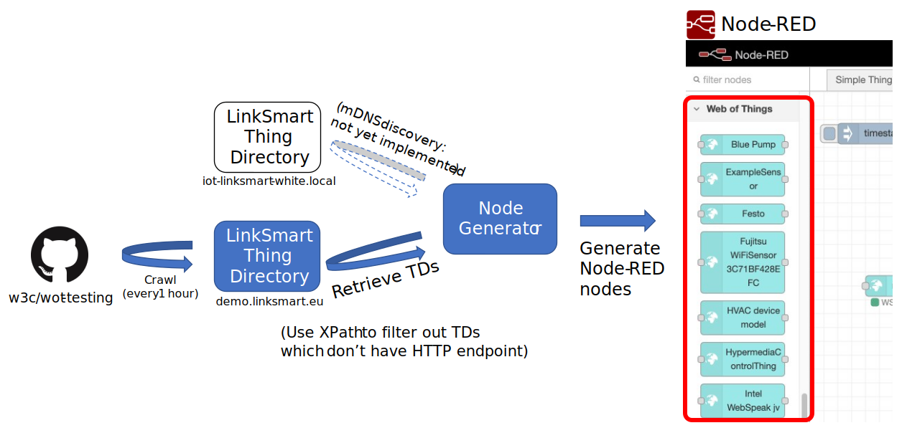
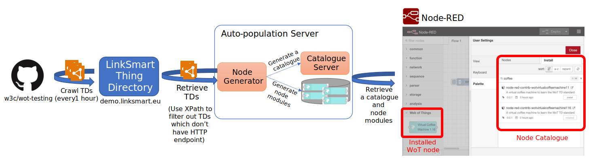

# Simple nodegen population script

A hacky script for incorporate all Things from LinkSmart Thing Directory to Node-RED (this is also an use case of XPath)



[Download](./nodepop.sh)

Not yet fully tested.  Use carefully.

## Prerequisites

- [Node-RED Node Generator](https://github.com/node-red/node-red-nodegen)
- [jq](https://stedolan.github.io/jq/)

## Usage

1. stop Node-RED if already started

2. move to Node-RED user directory (default: ~/.node-red)
```
% cd ~/.node-red
```

3. execute `nodepop.sh`
```
% sh /path/to/nodepop.sh
```

4. execute Node-RED.  Incorporated nodes are in 'Web of Things' category on your pallette.

# Updated version (2020.7)
- Support dynamic loading.  No need for restart Node-RED runtime.
- Install WoT nodes from standard Node-RED palette management UI.



## Usage, code

(TBD)

## Demo

[Demo video](./autopop_with_voice.mp4)
