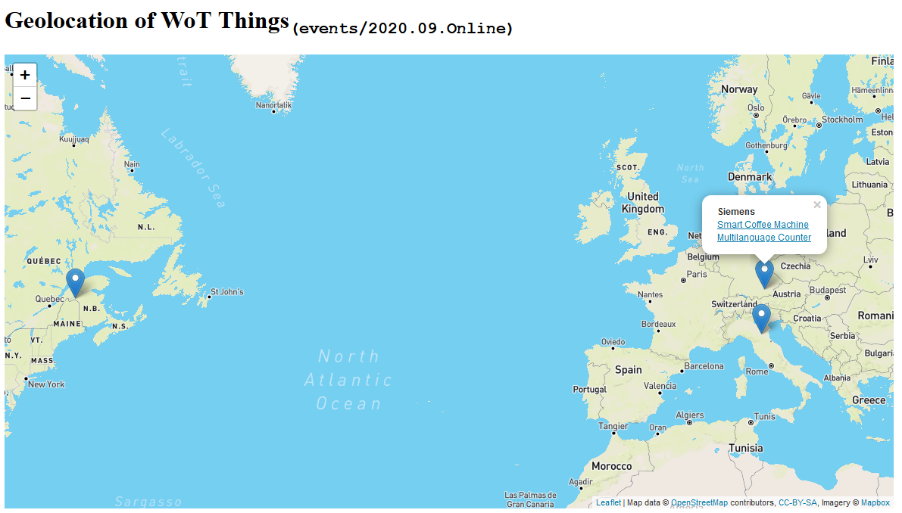

# Siemens - September 2020 Online Plugfest

We expose the following virtual things (with [node-wot](https://github.com/eclipse/thingweb.node-wot/)):
* [Smart-Coffee-Machine](http://plugfest.thingweb.io:8083/smart-coffee-machine)
* [TestThing](http://plugfest.thingweb.io:8083/testthing)
* [Multilanguage Counter](http://plugfest.thingweb.io:8083/counter)

## WebUIs

Moreover, there are several Web UIs available:
* [Generic WebUI](http://plugfest.thingweb.io/webui/)
* [Smart Coffee Machine - Property Live Monitor](http://plugfest.thingweb.io/examples/smart-coffee-machine.html)
* [Counter UI](http://plugfest.thingweb.io/examples/counter.html)
* [WoT-FXUI](http://plugfest.thingweb.io:8088/test/fullscreen/default)

## Geolocation of WoT Things (Mockup)

see [HTML map online](https://htmlpreview.github.io/?https://github.com/w3c/wot-testing/blob/master/events/2020.09.Online/TDs/Siemens/geolocation-ui.html)
