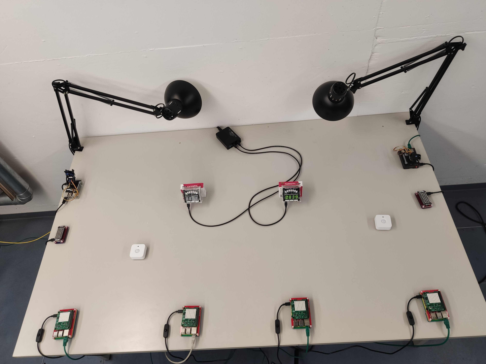
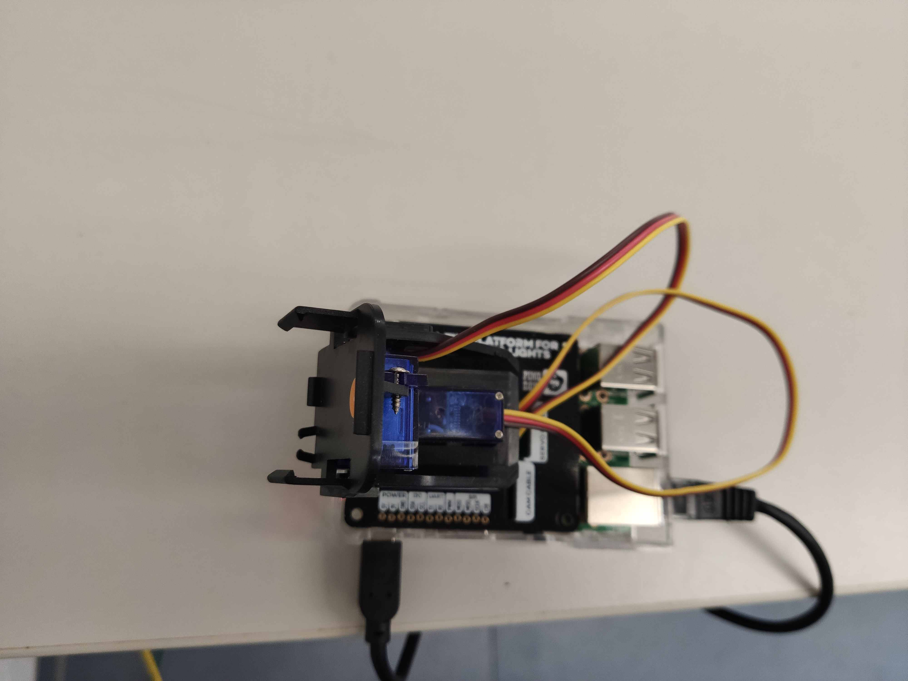
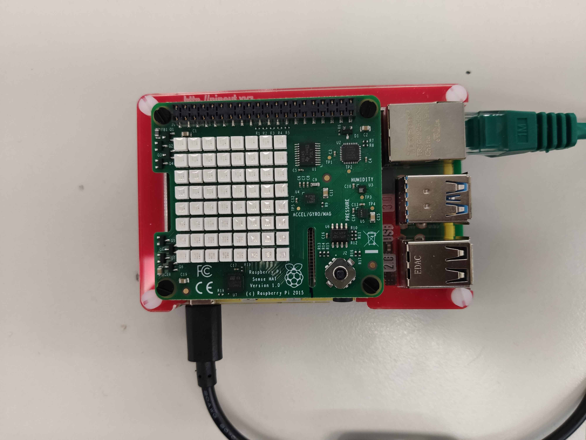
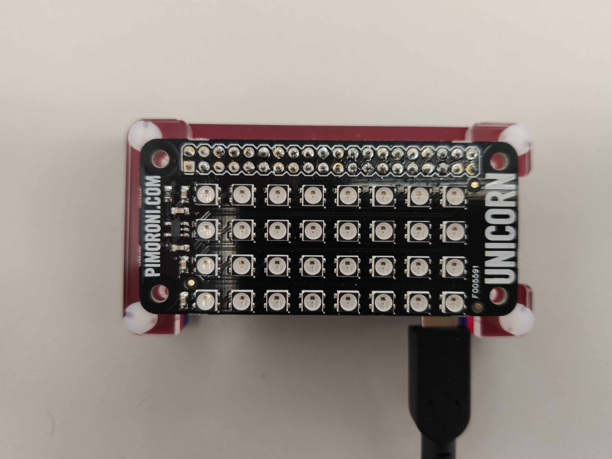
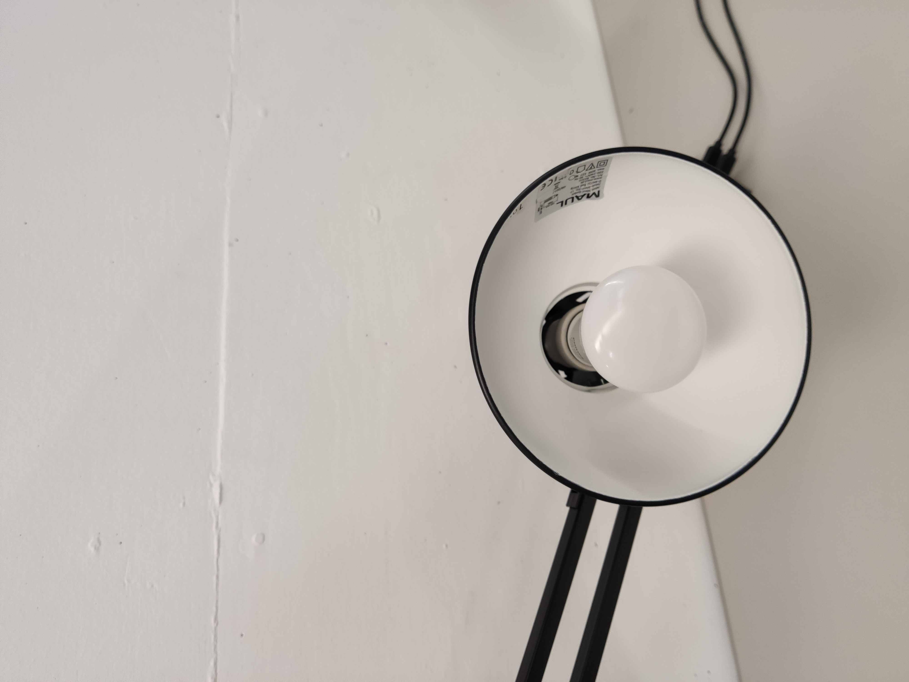

# TUM Devices

## General Setup

We have a room with controlled lighting where different WoT devices are placed on two desks.
Both the lights and the devices of Desk 1 are regularly turned off everyday from 4am to 6am UTC+2. This can be modified upon request.
The devices are in a local network over WiFi or Ethernet and are bridged over a custom reverse proxy to the public Internet but with Basic Auth.
There are live streams available and more information is available below.
The devices on Desk 1 are more simple devices that can be used by multiple Consumers at the same time.
The devices on Desk 2 are more complex and interacting with them at the same time as another Consumer can cause problems.
More information on the devices are below.  

The streams and TDs of devices are available at our homepage at https://esiremotelab.esi.ei.tum.de/.

## Authentication for the Web Page

The page linked above needs authentication to access the streams and the streams.
Contact ege.korkan@tum.de to obtain access rights.
These credentials do not give interaction authentication with the devices, you will be provided with a second set of credentials.

We track the usage of the website via Matomo. By requesting access, you agree on the collection of anonymous information about the session.

## Live Streams

We have 3 cameras pointing at the devices on two desks. 1 camera for Desk 1 and 2 for Desk 2.
The streams are provided via WebRTC which requires you to have ports open on 50000 to 502000. 
We did not have any issues regarding scalability after one semester of teaching.

## Physical Devices

**Note:** Photos will be uploaded on 28.09.2020

### Desk1

### Custom Made Devices

- PanTilt HAT: This is a platform meant to attach video surveillance cameras. Ours do not have a camera attached, but the platform can tilt (moving up and down) and pan (moving left and right). The actions are asynchronous, meaning that a response is returned when the request is successful but the platform will keep moving. The platform stops automatically when it reaches end points.

- Rainbow HAT: This HAT has different environment sensors, LEDs and touch buttons. The touch buttons are capacitive and need human interaction.

- Sense HAT: This HAT is similar to RainbowHAT but it has an LED matrix instead of single LEDs and 7 segment displays. There is a button that can be pressed which triggers the event emissions. On Monday, Tuesday and Thursday, this button will be pressed by a robot every 20 minutes.

- Unicorn pHAT: This is small LED Matrix.

**Note:** Most environment sensor values should not be trusted since the sensors are not calibrated. However, they are reliable :)

### Philips Hue Devices

- HueColorLight: This is a light bulb whose color can be adjusted in different ways. The descriptions of each interaction should be read to understand how to use different parameters. The light bulbs do not point to the cameras to not have problems with exposure, they point to the wall behind them.

- HueDaylight: This is a software running in the Hue Bridge that tells whether there is daylight outside or not. This is based on the current time and the GPS position. However, the room's windows are covered to have regulated lighting, so not much use of this "sensor". 
- HueDimmerSwitch: This is a switch that is preprogrammed to turn off/on the lights and change their brightness. The button presses are not events but they need to be constantly polled.
- HueIndoorSensor: These are the two white square Things on the table. They measure light intensity and notify if there is movement in the room.

- HueOutdoorSensor: This sensor is not visible in any camera stream but it is positioned to the left of the Desk 1. Its functionality is identical to the IndoorSensor.

**Note:** The lights are bridged over the Hue Bridge and we do not change their APIs in any way. The responses returned from the devices (which is the Hue Bridge) have always 2XX code, even if the light is not even screwed in.
You have to parse the responses if you want to handle such status responses.
In other words, do not put any meaning into the status codes.

### Desk2

- uArm Robot: This is the black robot seen on the top part of the second stream. It can be moved to any position and pick up objects. If you move the robot when it cannot move (when there is something on the way), the software library that we are using loses the position and thinks that it has moved to where you wanted it to. Thus, in such cases, use the reset action. Otherwise, the robot restarts every hour and fixes this problem. 

- Dobot Magician Robot: This is the white robot seen on the bottom part of the second stream. It is mounted on a sliding rail and can be moved to preprogrammed locations and pick up objects if the objects are on those positions.

- Infrared Sensor: These sensor detect if a cube passes in front of them and send an event.

- Conveyor Belt: These belts can be run forward or backwards with a speed set in their properties. They should be stopped when not in use to avoid damaging the hardware.

## Simulations

We have multiple virtual Coffee machines simulated on HTTP and CoAP.
CoAP and HTTP instances are all accessible over the IP address 129.187.45.174 but with different port numbers of course.

Expected Behavior: The property values are generated at each request and are random. 
Similarly, if there is an action that will send output, it is automatically generated.
Events are emitted at pre-configured intervals of around 8 and 10 seconds. 
This can be changed if requested.

For each protocol, there are 16 instances but this can be increased to 1000+ if needed.
Also, if you have a device whose TD is available and you want a simulation, simply send the TD and the event emission intervals.

### HTTP

The list of TDs can be found at http://129.187.45.174:8080
One example would be http://129.187.45.174:8080/Virtual-Coffee-Machine_1_1 until 1_16

### CoAP

The list of TDs can be found at coap://129.187.45.174:5683
One example would be coap://129.187.45.174:5683/Virtual-Coffee-Machine_2_1  until 2_16

### Implementation details

They are made possible via [shadow-thing](https://github.com/tum-esi/shadow-thing)
[Images/Desk1/Desk1.jpg]: https://dl.acm.org/doi/abs/10.1145/1985394.1985398
