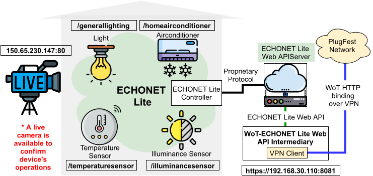

# ECHONET Lite Web API/WoT Integration

## Participants
* Van Cu PHAM (Japan Advanced Institute of Science and Technology, ECHONET Consortium)
* Toumura
* Koster (T.B.C.)
* Scripting API TF (T.B.C.)

## Things planned to be done
* Devices
    * LED light
    * Air conditioner
    * Temperature sensor
    * Illuminance sensor
* Accessing ECHONET devices from one or more WoT consumers (e.g. Node-RED (Tomura), node-wot (need volunteer) )
  * In this PlugFest, we provide an intermediary that provides translated web APIs via a translation service ("translating proxy"). The intermediary translates payloads so that they can be described with TD data schemas.
 
* Camera is not accessible yet (we are waiting for the administrative procedure to be completed).

* TMs/ODM for ECHONET Device Descriptions (T.B.C. by Koster)
  * See https://echonet.jp/web_api/ for JSON device descriptions. These are very similar to TMs, and also include both JA and EN descriptions, so readable for EN readers
Generating TDs for ECHONET Lite Web APIs.

## Logistics:
* It is necessary to use the VPN to access the ECHONET Lite devices via the intermediary.
