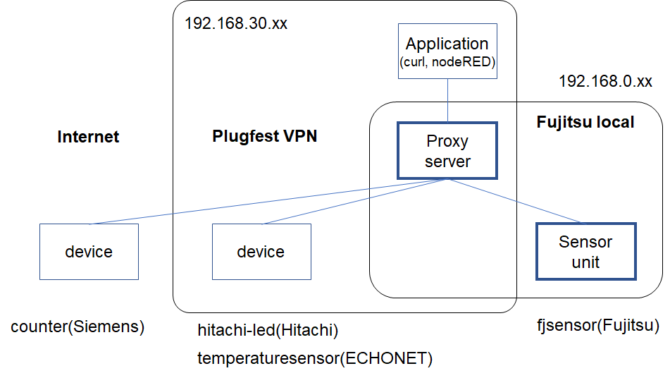

# Fujitsu - Proxy server and Shadows

## Participants

- Ryuichi Matsukura

## Proxy server
The proxy server can generate shadow devices corresponding to the real devices on the server to prevent the applications from directly 
operating the real devices. This proxy can hide the network to which the real devices are connected, 
and allows access with one protocol, such as HTTP, even if the multiple real devices offer multiple protocols.

In this project, the proxy provides shadows for the devices connected to the Internet,  within the VPN, and to the local network 
isoleted from the Internet and VPN. The applications(consumers) can operate the devices by handling the shadows insted, 
and can use them without being aware of how they are connected.

When a real device TD is registered to the proxy, the corresponding shadow TD will be generated. To operate this real device, 
the application should use this shadow instead. It can get the list of registered shadows from the proxy, and retrieve shadow TD
with specifying the required device.

## Discovery
The proxy server can be queried by the name "wot-proxy". The txt field indicates 
the URLs for the interface to create a shadow device (register) and the other interface to get 
the Thing Descriptions of the shadow devices already existed (retrieve).
```
% avahi-browse -r _wot._tcp
+ vpn_vpn IPv4 wot-proxy                                  _wot._tcp            local
= vpn_vpn IPv4 wot-proxy                                  _wot._tcp            local
   hostname = [ip-192-168-30-134-ec2-internal.local]
   address = [192.168.30.134]
   port = [80]
   txt = ["register=/Things" "retrieve=/Things"]
```
The sensor unit for this plugfest can search the proxy server in the initializaing, and request to create 
its shadow on it. Therefore even the device invisible from the VPN can be operated via the proxy server.

## APIs
- To get a list of registered shadows.
```
curl http://192.168.30.134/Things

(response) ["urn:dev:mac:b827ebfffe4b6d0b","echonet:temperatureSensor:19216815001101","urn:com:fujitsu:sensor"]
```

- To register a real device.
```
curl -X POST -H 'content-type: application/json' -d @fjsensor.td.jsonld http://192.168.30.134/Things
```
where "fjsensor.td.jsonld" is the file name of the TD.


- To delete a shadow device.
```
curl -X DELETE http://192.168.30.134/Things/urn:com:fujitsu:sensor
```

- To retrieve a shadow TD.
```
curl http://192.168.30.134/Things/urn:com:fujitsu:sensor
```

- To retrieve a real device TD.
```
curl http://192.168.30.134/Things/urn:com:fujitsu:sensor?type=original
```

## Network diagram in this plugefst/testfest



## Checked devices
Counter(Siemens) on the Internet, LED(Hitachi) and temperature sensor(ECHONET) on VPN, sensor unit(Fujitsu) on the local network.
