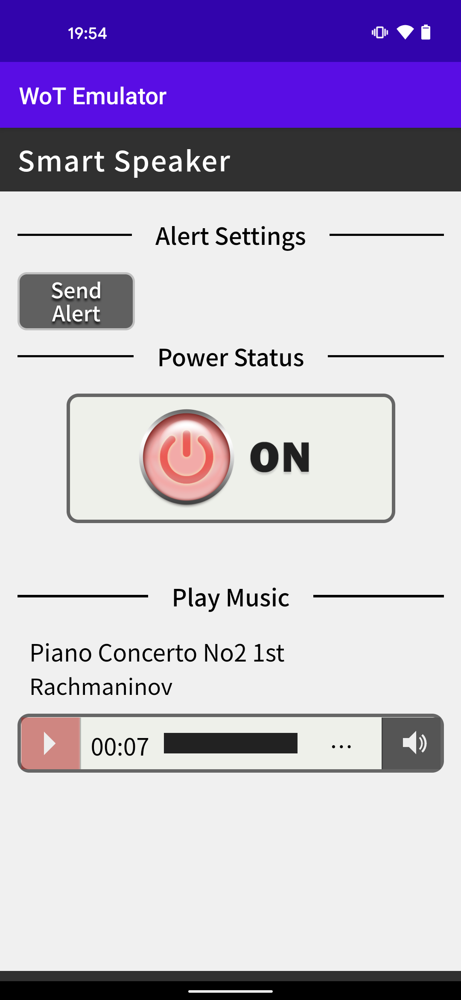
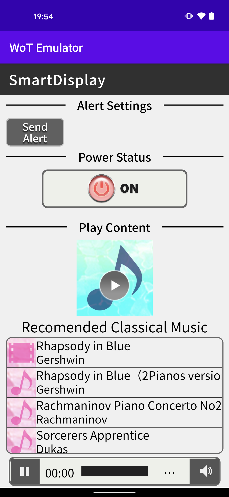

# NHK WoT Device Emulator

## Things
* Devices
    * Smart speaker (emulator)
     
    * Smart display (emulator)
     
    * Smart cutting board (emulator)

* WoT Device Emulator
  * becomes a virtual device by registering TD 
  * uses web app as User Interface
  * Automatically serves Web API described in TD
  * Supports DNS-Based Service Discovery
 

