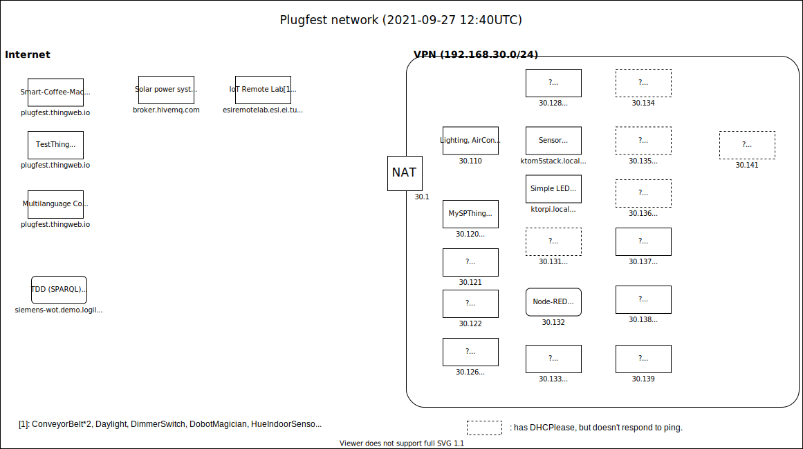

# WoT Sept 2021 Plugfest/Testfest

## Logistics 
* Date: Sept 27-Oct 1
* Time: 9am-10am (Eastern Time) daily sync meeting
* Location: WebEx: for [Members](https://lists.w3.org/Archives/Member/member-wot-wg/2021Sep/0001.html) and for [IEs](https://lists.w3.org/Archives/Group/group-wot-ie/2021Sep/0000.html)
* VPN: [Instructions](https://github.com/w3c/wot-testing/tree/main/tools/vpn)
* [Project Descriptions](Projects/README.md)

## To Do
* Do we keep using issues for projects and outcomes?
* Is there a better way?
* Should we close older issues/outcomes?

## Testfest

### Thing Description
* Update implementation descriptions
* Capture validated TDs
* Carry forward older TDs as appropriate
* Identify gaps in testing
* Generate test cases to fill gaps
* Identify features that need manual assertions from implementors

### Discovery
* Update implementation descriptions
* Collect tests into a single test suite
* Match tests with features
* Identify gaps in testing (features without tests)
* Generate test cases to fill gaps
* Identify features that need manual assertions from implementors

Logistics:
* Testing requires a live service for TDD to poke at
** Globally visible TDD service using LinkSmart is straightforward
** Other TDD supports SPARQL
* Also needs at least two Things that can provide peer-to-peer discovery
* Various Introductions also useful, e.g. mDNS, DNS-SD
** mDNS testing in turn needs VPN
* Note RIoT supports .well-known and Core Link intros
* Still need DID test case

## Plugfest

### RIoT Integration
Participants: Blum, Romann, McCool
* Arduino implementation
* Tutorial review and update

Logistics:
* RIoT is natively v6
* Supports CoAP
* Supports .well-known and CoreLink introduction mechanisms for discovery
* VPN is currently only v4; to set up to use v6 needs some reconfiguration (at least)
* Arduino may be able to use v4; separate implementation

### One Data Model
Participants: Koster
* Toolchains for converting from ODM/SDF models to TMs
* May overlap with ECHONET integration

### ECHONET Lite Web API/WoT Integration

#### Participants
* Van Cu PHAM (Japan Advanced Institute of Science and Technology, ECHONET Consortium)
* Tomura
* Koster (T.B.C.)

#### Things planned to be done
* Accessing ECHONET devices from one or more WoT consumers (e.g. Node-RED (Tomura), node-wot (need volunteer) )
  * In this PlugFest, we provide an intermediary that provides translated web APIs via a translation service ("translating proxy"). The intermediary translates payloads so that they can be described with TD data schemas. See https://github.com/w3c/wot-testing/blob/main/events/2021.09.Online/Projects/ECHONET/20210917_Plugfest_ECHONETControllerUpdated.pdf

* TMs/ODM for ECHONET Device Descriptions (T.B.C. by Koster)
  * See https://echonet.jp/web_api/ for JSON device descriptions. These are very similar to TMs, and also include both JA and EN descriptions, so readable for EN readers
Generating TDs for ECHONET Lite Web APIs.

#### Logistics:
* It is necessary to use the VPN to access the ECHONET Lite devices via the intermediary.

### Node-RED
Participants: Toumura, McCool
* Discovery integration (MDNS + TDD queries)
* Semantic/keyword searches
* Retail use case (Connexxus)
* Will be used to exercise ECHONET
** Use Node-RED as a client
** ECHONET Web API provides only servers

### Node-WoT
Particpants: Siemens (Sebastian)? Daniel? TUM (Ege)?
* Discovery integration
* Use as client for ECHONET above
** In which case it needs to be on the VPN

### Geospatial (Meta)Data
Participants: McCool
* Test encoding of geospatial data in TDs using extension
** Semantic extension - ontology, etc.
** Query extension to TDDs - collaborate with OGC, IEEE, SDW, etc.
** Introduction mechanisms - Spatial DNS - IETF collab
* SPARQL queries in TDD?
** Prototype spatial search using brute-force filtering.

### NHK
* WoT device emulator (Android App)
  * Generates web apis based on TD
  * Behaves in a WebView web app
  * https://github.com/endouhhc/wot-testing/blob/nhkproject/events/2021.09.Online/Projects/NHK/README.md

### Other Possible Projects

#### EdgeX
Participants: ?

#### Web Things
Participants: ?
* TD Testing

#### LinkSmart
Participants: Farshid, McCool

#### Signing and Canonicalization
Participants: McCool
* Tool chain for canonicalization and signing
* Extension for EJS
* Generation of examples

## Network configuration

