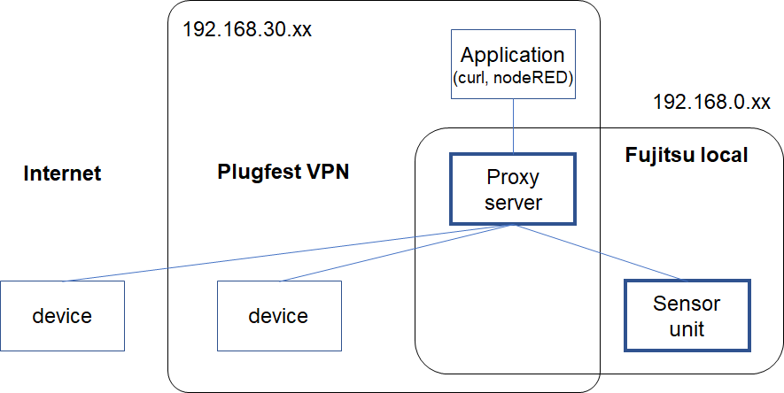
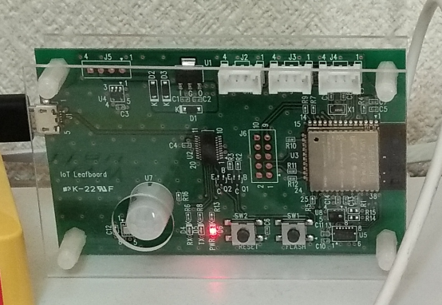
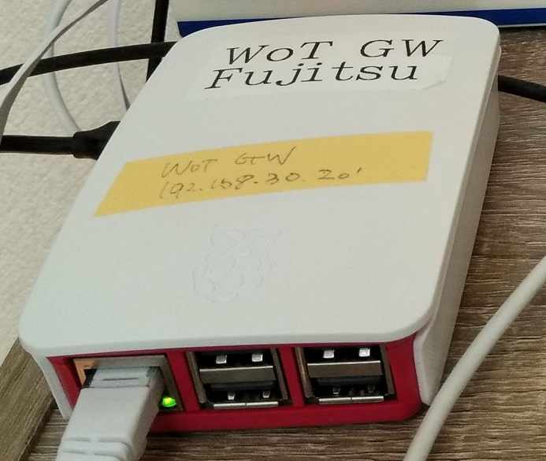

# Fujitsu - TPAC2021 Online Testfest

Fujitsu offers two services:
- Sensor unit (temperature, humidity, and airpressure)
- Proxy server

The folloing is the network configuration.


The proxy server is on the border between the VPN and Fujitsu local network and has 2 IP addresses for both of them.
On the other hand, the sensor unit is on the local network and cannot be accessed directly from the VPN. 
In this setting, the shadow device of the sensor unit has been created on the proxy server, and then
applications on the VPN can reach to the sensor unit indirectly through the endpoint that the shadow device opens.


## discovery

The proxy server and the sensor unit support mDNS to allow discovery within the same network.
The contents you can get through mDNS are as follows:
   
```
% avahi-browse -r _wot._tcp
+ eth0 IPv4 fjsensor-esp32                                _wot._tcp            local
= eth0 IPv4 fjsensor-esp32                                _wot._tcp            local
   hostname = [fjsensor-esp32.local]
   address = [192.168.0.18]
   port = [80]
   txt = ["type=Thing" "td=/.well-known/wot-thing-description"]
```

The sensor unit can be queried by the service "wot" and protocol "tcp", and 
the Thing Description can be retrieved from URL described in txt. 

```
% avahi-browse -r _wot._tcp
+ vpn_vpn IPv4 wot-proxy                                  _wot._tcp            local
= vpn_vpn IPv4 wot-proxy                                  _wot._tcp            local
   hostname = [ip-192-168-30-134-ec2-internal.local]
   address = [192.168.30.134]
   port = [80]
   txt = ["register=/Things" "retrieve=/Things"]
```

The proxy server can be queried by the name "wot-proxy". The txt field indicates 
the URLs for the interface to create a shadow device (register) and the other interface to get 
the Thing Descriptions of the shadow devices already existed (retrive).

The sensor unit for this plugfest can search the proxy server in the initializaing, and request to create 
its shadow on it. Therefore even the device invisible from the VPN can be operated via the proxy server.

## Implementations

This sensor unit is composed of Wi-Fi communication modele ESP32 and some sensor devices. 
The software was developed in C++ using Arduino. 
The proxy server is implemented in JAVA and can run on Linux and Windows. The current server is running on a Raspberry Pi.
The server also worked on the cloud last year but now stopped. If the local and cloud proxies are federated, the cloud application
can operate the local devices that cannot be accessed directroy from the cloud.

## Thing Description and interfaces

### sensor unit



The TD of the sensor unit is here. To get the TD from the unit, do the folloging:

```
curl http://192.168.0.18/.well-known/wot-thing-description
```

The sensor is invisible and cannot be connected from the VPN because it is on the local network. 
So you can access the endpoint of this shadow device on the proxy instead of the real device. 
The TD of the shadow device is here, which can be get from the proxy in the following way.  

```
curl http://192.168.30.134/Things/urn:com:fujitsu:sensor
```
where "urn:com:fujitsu:sensor" is the device ID.

### proxy server



Any device accessible from the proxy server can expose its endpoint to the proxy as a shadow device.
In this case, register the TD of the device with the proxy as follows.

```
curl -X POST -H 'content-type: application/json' -d @filenme http://192.168.30.134/Things

```
where filenme is the TD file name like "fjsensor.td.jsonld".

Our sensor unit searches for proxy servers and registers own TD to the proxy server.

The already registered shadows can be listed in the following way.

```
curl http://192.168.30.134/Things

(response) ["urn:dev:mac:b827ebfffe4b6d0b","echonet:temperatureSensor:19216815001101","urn:com:fujitsu:sensor"]
```

The response includes the list of the shadow device IDs. This TD can be got from the proxy server as follows:

```
curl http://192.168.30.134/Things/urn:com:fujitsu:sensor
```

The shadow device TD is here.

## Checked devices.

Some devices on the Fujitsu local network, VPN, and the Internet were checked to genrate shadow TDs on our proxy
and to be operated by the application on VPN.


checked devices:

Counter(Siemens) on the Internet,

LED(Hitachi) and temperature sensor(ECHONET) on VPN,

sensor unit(FUjitsu) on the local network.
