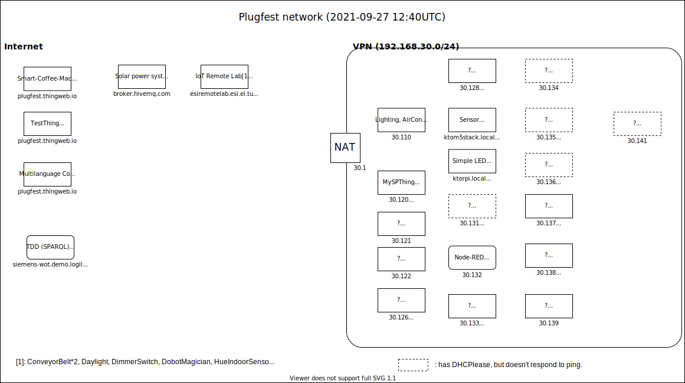

# W3C Web of Things (WoT) Sept 2021 Plugfest/Testfest
This event combined testing of existing specifications with prototypes of new systems.

## Testing

### Thing Description
* Recategorized implementations by codebase rather than organization
* Captured validated TDs
* Generated updated input data for implementation report generator
* Used as initial set of test TD for CR transition testing

### Discovery
A test suite exists but needs further development and
tooling support.

## Plugfest Projects

Details of individual project definitions and results are available in the following locations:
* [Results directory](https://github.com/w3c/wot-testing/blob/main/events/2021.09.Online/RESULTS)
* [Issue tracker](https://github.com/w3c/wot-testing/labels/Plugfest%202021.09)
* [F2F presentation](https://github.com/w3c/wot/blob/main/PRESENTATIONS/2021-10-online-f2f/2021-10-11-WoT-OpenDay-McCool.pdf)

### ECHONET Lite Web API/WoT Integration

#### Participants
* Van Cu PHAM - Japan Advanced Institute of Science and Technology, ECHONET Consortium
* Kunihiko Toumura - Hitachi
* Michael Koster

#### Description and Purpose
* Demonstration and the ability to access ECHONET devices from one or more WoT consumers (e.g. Node-RED (Tomura), node-wot)
* In this PlugFest, we provided an intermediary that provides translated web APIs via a translation service ("translating proxy"). 
* The intermediary translates payloads so that they can be described with TD data schemas. 
* See https://github.com/w3c/wot-testing/blob/main/events/2021.09.Online/Projects/ECHONET/20210917_Plugfest_ECHONETControllerUpdated.pdf

* TMs/ODM for ECHONET Device Descriptions (T.B.C. by Koster)
  * See https://echonet.jp/web_api/ for JSON device descriptions. 
  * These are very similar to TMs, and also include both Japanese and English descriptions, so are readable for English readers
* Generation of TDs for ECHONET Lite Web APIs.

### Node-RED integration (SPARQL query)

#### Participants
* Kunihiko Toumura - Hitachi
* Michael McCool - Intel

#### Description and Purpose
* Test WoT Discovery integration 
  * MDNS introductions
  * TDD queries
  * Semantic/keyword searches based on SPARQL
* Retail use case (Connexxus)
* Will also be used to exercise ECHONET
* Use of Node-RED as a client
  * ECHONET Web API provides only servers

### Node-WoT
####
Participants: 
* Sebastian Kaebisch - Siemens
* Daniel Peintner
* Ege Korkan - TUM
* Cristiano Aguzzi

#### Description and Purpose
* Discovery integration
* Use as client for ECHONET above
   * Using VPN to simulate local network
* Evaluate new action models
   * Multiple operations
   * Hypermedia approach

### Geospatial (Meta)Data
#### Participants
* Michael McCool - Intel

#### Description and Purpose
* Test encoding of geospatial data in TDs using extension
  * Semantic extension - ontology, etc.
  * Query extension to TDDs - collaborate with OGC, IEEE, SDW, etc.
  * Introduction mechanisms - Spatial DNS - IETF collab
* SPARQL queries in TDD?
  * Prototype spatial search using brute-force filtering.

### NHK
* WoT device emulator 
  * Android App
  * Generates web APIs based on a TD
  * Behaves in a WebView web app
 
See: https://github.com/w3c/wot-testing/blob/main/events/2021.09.Online/Projects/NHK/README.md

### TM Composition 
#### Participants
* Sebastian Kaebisch - Siemens
#### Description and Purpose
* [A new feature to compose Thing Models](https://pr-preview.s3.amazonaws.com/w3c/wot-thing-description/pull/1207.html#thing-model-composition) has been introduced.
*[Examples](https://github.com/w3c/wot-testing/tree/main/events/2021.09.Online/TD/TMs/Siemens) were created to gain experience with this modeling concept and to generate TD instances.  
* During the vF2F Thing Description session, a short [presentation](https://github.com/w3c/wot/blob/main/PRESENTATIONS/2021-10-online-f2f/2021-10-07-WoT-F2F-TD-Kaebisch.pdf) was provided (slide 7). 

### UPM / WoT Hive TDD
#### Participants
* Andrea Cimmino Arriaga - UPM
#### Description and Purpose
The Ontology Engineering Group at the Universidad Politécnica de Madrid (UPM) 
implemented a Thing Description Directoryc called WoT Hive
following the current WoT Discovery specification. 

### WoT Device Emulator 
#### Participants
* endouhhc
#### Description and Purpose

### Testbench 
#### Participants
* Ege Korkan - TUM
#### Description and Purpose
 
### Hypermedia Action Protocol 
#### Participants 
* relu91
#### Description and Purpose
* Propose mechanisms to use hypermedia to define action protocols

### Shadow Proxy 
#### Participants
* Ryuichi Matsukura - Fujitsu 
#### Description and Purpose
* Proxy that also caches state
* Allows clients to power down and go offline to save power

### SDF Conversion 
#### Participants
* Michael Koster

#### Description and Purpose
* Test tooling to convert IETF SDF models into TMs
* Check for overlap of feature set between SDF and TMs

### Logilab TDD 
#### Participants
* Sebastian Kaebisch - Siemens

#### Description and Purpose
* A partial implementation of a TDD for WoT Discovery providing a SPARQL endpoint
* To test semantic queries and discovery integration

## Network configuration

