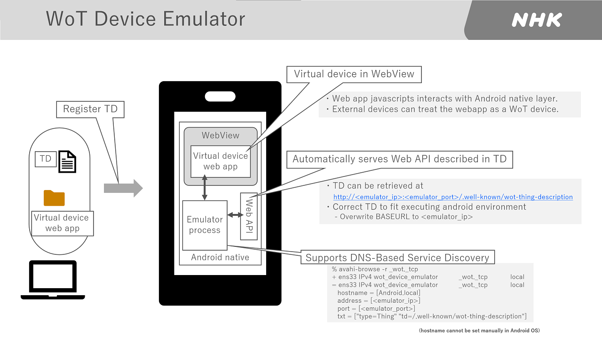
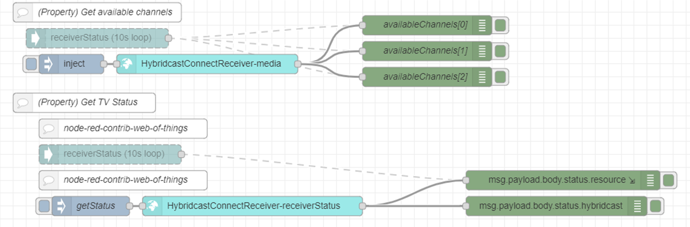

# NHK Things

## Emulated Devices by WoT Device Emulator
* Emulated Devices by WoT Device Emulator
  * Emulated smart speaker [td](TDs/nhk-emulatedSpeaker.td.jsonld)
  * Emulated smart display [td](TDs/nhk-emulatedDisplay.td.jsonld)

     
     

### WoT Device Emulator
  * becomes a virtual device by registering TD
  * uses web app as User Interface
  * Automatically serves Web API described in TD
  * Supports DNS-Based Service Discovery
 

## Hybridcast TV [td](/TDs/nhk-tv.jsonld)
- Hybrid TV Emulator AndroidTV App
   - https://github.com/nhkrd/antwapp4hc
   - dns-sd is not supported in current version on github.

### API
Please see [flows for Node-RED](https://github.com/w3c/wot-testing/blob/master/events/2020.09.Online/TDs/NHK/flows_nhk_plugfest202009.json)

### readproperty to get a list of available TV channels & TV status

### invokeaction to tune to a specified TV channel & launch Hybridcast applications

### subscribeevent to receive message from TV applictions

### DEMO
[[Video] invokeaction to tune to a specified TV channel and to launch a Hybridcast app](actionTune_and_actionLaunchHybridcastApp.mp4)

## Related Works

### hyconet.js
- Javascript inplementation of standardized Hybridcast-Connect API
- https://github.com/nhkrd/hyconet.js

### node-red-contrib-hyconet
- Node-RED extra node plugin for hyconet.js (Hybridcast-Connect Javascript SDK)
- https://github.com/nhkrd/node-red-contrib-hyconet

