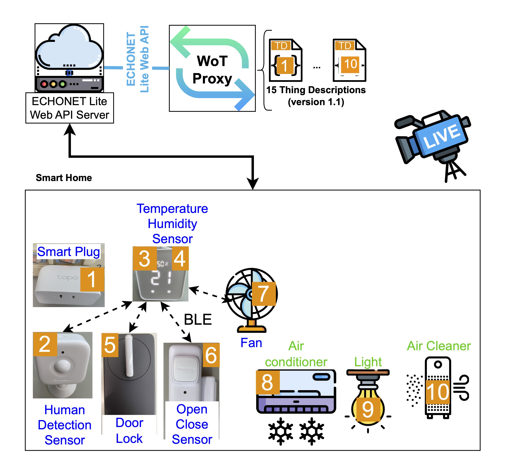

# ECHONET

## ECHONET Lite Smart Home Appliances

We have 2 set-up: 
### Onsite: 3 devices

- [Air Conditioner](./TDFiles/airconditioner.td.jsonld)
- [Ceiling Light](./TDFiles/celingLight.td.jsonld)
- [Door Lock](./TDFiles/doorLock.td.jsonld)

### Remote: 11 devices 

- [Smart Plug (1)](./TDFiles/remoteSmartPlug.td.jsonld)
- [Human Detection Sensor (2)](./TDFiles/remoteHumanDetectionSensor.td.jsonld)
- [Temperature Sensor (3)](./TDFiles/remoteTemperatureSensor.td.jsonld)
- [Humidity Sensor (4)](./TDFiles/remoteHumiditySensor.td.jsonld)
- [Electric Lock (5)](./TDFiles/remoteElectricLock.td.jsonld)
- [Open Close Sensor (6)](./TDFiles/remoteOpenCloseSensor.td.jsonld)
- [SmartPlug/Fan (7)](./TDFiles/remoteSmartPlug2.td.jsonld)
- [Air Conditioner (8)](./TDFiles/remoteAirconditioner.td.jsonld)
- [Ceiling Light (9)](./TDFiles/remoteCeilingLight.td.jsonld)
- [Air Cleaner (10)](./TDFiles/remoteAirCleaner.td.jsonld)
- [Human Detection sensor](./TDFiles/remoteHumanDetectionSensor2.td.jsonld)

You can confirm the operation of remote devices via web camera!

Have fun!
