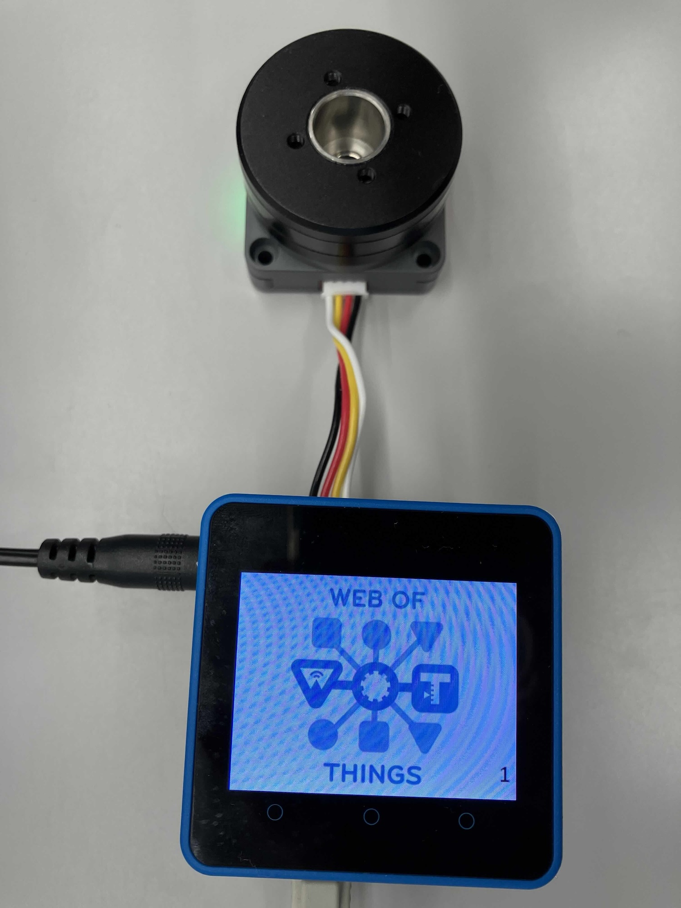

# Hitachi

## Brushless DC Motor / Rotary Encoder / LED

- [Thing Description](./roller1.td.jsonld)

This Thing is an integrated unit consisting of a Brushless DC Motor (BLDC motor),
a Rotary Encoder, and an LED.

To use this Thing, you must perform an initialization step:
- first, enable the motor using the `enable_motor` action,
- and then set the desired operating mode using the `set_mode` action.

Please note that if you do not perform this setup, the motor will not operate according to 
the specified speed or position settings.

Furthermore, the state of the Thing and the control of the LED can be
accessed without any prior initialization.